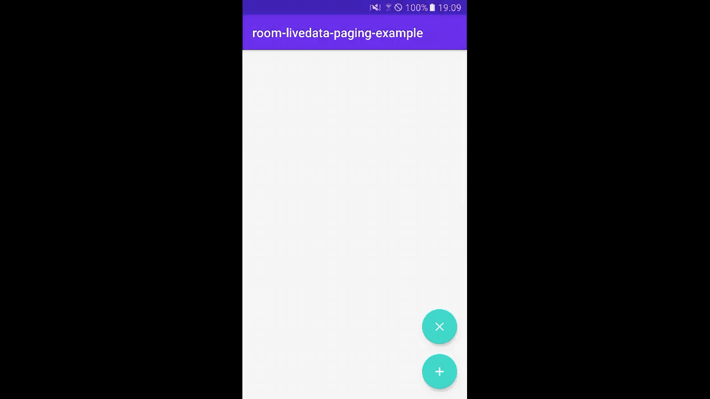

# Android Paging library with Room+LiveData  example

A simple android application implementing Paging library with Room persistence library.
## Getting Started
This sample uses the Gradle build system. To build this project, use the "gradlew build" command or use "Import Project" in Android Studio.

## Demo

